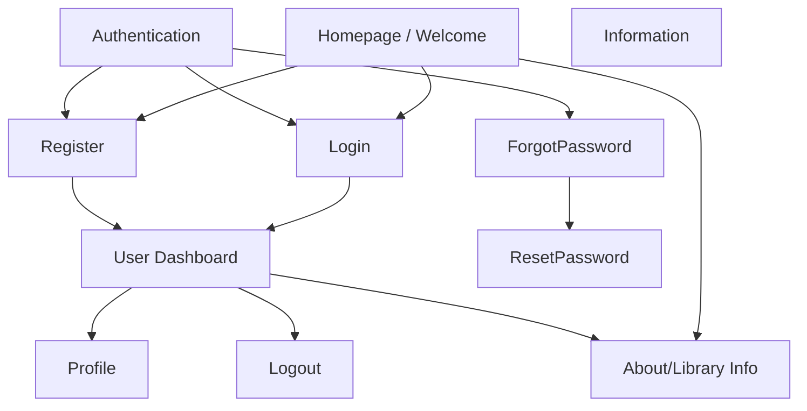
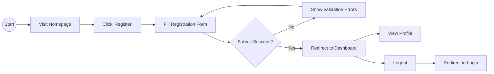

# PROJECT OVERVIEW

## 1.1 Introduction

The Library System is a comprehensive web application designed to modernize library operations and enhance the user experience for both patrons and administrators. It serves as a digital gateway to the library's resources, allowing users to create accounts, manage their profiles, and access library information securely. The project aims to streamline the traditional library experience by providing a user-friendly online interface.

**Target Users:**

-   **Library Patrons:** Individuals who wish to access library services, check their account status, and view library information.
-   **Administrators/Staff:** Library personnel responsible for managing the system and ensuring smooth operations.
-   **Public Visitors:** Guests looking for general information about the library (hours, location, mission).

**Purpose:**
The primary purpose is to provide a secure, efficient, and accessible platform that facilitates user interaction with the library system. It acts as a foundational system for managing user identities and providing personalized dashboards.

## 1.2 Objectives of the Website

The main goals of the Library System website are:

-   **To Inform:** Provide clear and accessible information about the library's mission, vision, and services.
-   **To Manage Identities:** Securely handle user registration, authentication, and profile management.
-   **To Engage:** Create a welcoming digital environment that encourages users to interact with the library.
-   **To Showcase:** Demonstrate a modern, responsive, and aesthetically pleasing web design.
-   **To Educate:** Serve as a functional example of a Laravel-based web application with robust authentication and modular architecture.

## 1.3 Project Scope

**Includes:**

-   **Pages:**
    -   **Welcome/Landing Page:** A visually appealing entry point.
    -   **Authentication Pages:** Login, Register, Forgot Password, Reset Password.
    -   **Dashboard:** A protected area for authenticated users.
    -   **Profile Page:** For managing user details.
    -   **About Page:** Information about the library.
-   **Features:**
    -   Secure user authentication (registration, login, logout).
    -   Password recovery mechanism (email links).
    -   Responsive design for various devices.
    -   Modular styling and blade templating.
    -   Interactive UI elements (transitions, hover effects).
-   **Content:**
    -   Library mission/vision.
    -   User-specific data on the dashboard.

**Does NOT Include:**

-   **Book Inventory Management:** No functionality for adding, editing, or deleting books in this version.
-   **Lending/Borrowing System:** No tracking of book loans or returns.
-   **Payment Processing:** No integration for fines or fees.
-   **Admin Panel:** No separate complex administration backend (admin functions are currently minimal/shared).
-   **Mobile App:** This is a web-based application, not a native mobile app.

---

# 2. WEBSITE PLANNING

## 2.1 Site Map

Below is the hierarchical structure of the website:



## 2.2 Storyboard / User Flow

This diagram represents the typical user journey for a new user registering and accessing the dashboard:



## 2.3 Wireframes

### Homepage

The entry point for all visitors, featuring a clear call to action.


### Content Page (User Dashboard)

The main hub for authenticated users to access their information.


### About/Focus Page

Information about the library's mission and vision.


---

# 3. DESIGN SPECIFICATIONS

## 3.1 Color Scheme

The project utilizes a warm, inviting palette rooted in orange/gold tones to evoke a sense of knowledge, warmth, and energy, balanced with professional neutrals.

-   **Primary Gold/Orange (`#d98c19`, `#e8a145`):** Used for primary buttons, active states, and key highlights. It draws attention and creates a friendly atmosphere.
-   **Secondary Navy (`#2c3e50`):** Used for headings, navigation text, and footers. It provides strong contrast and a sense of trust and stability.
-   **Neutrals (`#f5f7fa`, `#ffffff`, `#333333`):** White and light gray backgrounds ensure high readability and a clean, modern look. Dark gray text is used for body content for optimal legibility.
-   **Accents:**
    -   **Success Green (`#27ae60`):** For success messages and positive indicators.
    -   **Error Red (`#e74c3c`):** For validation errors and critical alerts.
    -   **Gradients (`#667eea` to `#764ba2`):** Used subtly in decorative elements (like book covers) to add depth and modern flair.

## 3.2 Typography

-   **Font Family:** The system primarily uses the `Segoe UI` font family (falling back to Tahoma, Geneva, Verdana, sans-serif).
-   **Usage:**
    -   **Headers:** Bold weights (600/700) are used for headings to establish a clear visual hierarchy.
    -   **Body Text:** Regular weights (400) occupy the majority of the content, ensuring comfortable reading.
    -   **Navigation:** Medium weights (500) are used for links to make them distinct but not overpowering.
-   **Reasoning:** System fonts like Segoe UI are highly legible, render perfectly on Windows (the target OS), and require zero network overhead, creating a snappy and native-feeling experience.

## 3.3 Layout & Composition Principles Applied

-   **Grid System:** A responsive grid layout is used, particularly in the dashboard (`.content-grid`), to ensure content organizes itself naturally across different screen sizes.
-   **Spacing and Alignment:** A consistent spacing scale (multiples of 4px/8px) is applied to padding and margins (`padding: 30px 40px`, `gap: 20px`), creating "breathing room" and preventing clutter.
-   **Visual Hierarchy:** Critical elements like Page Titles and Primary Buttons are largest and most colorful, guiding the user's eye naturally from top to bottom.
-   **Balance and Contrast:** High contrast between text and background (dark text on light bg) guarantees readability. The Dashboard uses a sidebar-main content split to balance navigation with information.

## 3.4 Images & Media

-   **Icons:** FontAwesome or similar vector icons are used for navigation and actions (e.g., search icon, user avatar, logout). They provide immediate visual cognition of functionality.
-   **Book Covers (CSS/Images):** The "Book of the Month" and releases use visual representations of books. This reinforces the "Library" theme and adds visual interest to an otherwise data-heavy dashboard.
-   **Generative/CSS Graphics:** CSS gradients are used to create book cover effects without needing heavy image assets, keeping the site fast.

---

# 4. WEBSITE DEVELOPMENT

## 4.1 HTML Structure

The HTML structure is built using semantic HTML5 tags to ensure the document outline is logical, navigable, and accessible.

-   **Semantic Elements:**

    -   `<header>`: Contains the site brand/logo and top-level navigation, serving as the consistent top anchor.
    -   `<nav>`: Wraps primary navigation links to identify them as the site's main directory.
    -   `<main>`: Encapsulates the unique/central content of the page, separating it from repeated headers/footers.
    -   `<section>`: Logical divisions within the page (e.g., Hero section, Features section).
    -   `<article>`: Independent content blocks, such as specific book cards or news items.
    -   `<footer>`: Contains copyright information and secondary links at the bottom of the layout.

-   **Accessibility & Readability:**
    -   **Forms:** All inputs utilize `<label>` tags explicitly linked via `for`/`id` attributes to ensure screen reader support.
    -   **Headings:** A proper hierarchy (`<h1>` for main titles, `<h2>` for section headers) creates a navigable structure for assistive technology.
    -   **Alt Text:** Informative `alt` attributes are used on images to describe functionality or content.

**Blade Templates Structure:**
All Blade templates in a Laravel project are stored inside the `resources/views` folder, which is organized into subfolders to keep the code modular and easy to maintain. For example, the `about` folder contains `about.blade.php`, which serves as the template for the About page. The `auth` folder holds several files related to authentication, including `forgot-password.blade.php` for requesting a reset link, `login.blade.php` for user login, `register.blade.php` for new user registration, and `reset-password.blade.php` for setting a new password. The `dashboard` folder includes `dashboard.blade.php`, which provides the main interface shown after login. Lastly, the `user` folder contains `welcome.blade.php`, typically used as a welcome page for users after registration or login. This structure ensures that each page or function has its own dedicated Blade file, making the application easier to manage and extend.

## 4.2 CSS Structure

The styling is modular and uses external stylesheets to maintain distinct separation of concerns.

-   **Styling Method:**

    -   **External CSS:** Styles are separated into individual files per page (e.g., `login.css`, `dashboard.css`) to reduce bloat and ensure only necessary code is loaded.
    -   **Classes & IDs:** Styling primarily targets **Classes** (e.g., `.btn-primary`, `.card`) for reusability. **IDs** are reserved for unique elements or JavaScript hooks.
    -   **Variables:** CSS Variables (`var(--primary)`) are defined in `:root` to maintain consistency in themes (colors, spacing) across the application.

-   **Layout Techniques:**
    -   **Flexbox:** Used frequently for one-dimensional layouts, such as aligning items in the navigation bar (`display: flex; justify-content: space-between`), centering form content, and handling linear component groups.
    -   **Grid:** Employed for two-dimensional layouts, specifically in the Dashboard's content area (`display: grid`) to create responsive, auto-filling rows of cards that adapt to screen width (using `repeat(auto-fit, ...)`).
    -   **Structured Divs:** Container divs (`.container`, `.wrapper`) are used to center content and manage max-widths.

**CSS File Organization:**
All CSS stylesheets in this Laravel project are located inside the `public/css` folder. This structure is typical for Laravel applications, where the public directory serves as the web-accessible root, and the `css` subfolder holds all the styling files. Within `public/css`, there are several CSS files, each corresponding to a specific page or component:

-   `dashboard.css` — styles for the dashboard interface.
-   `forgot.css` — styles for the forgot password page.
-   `login.css` — styles for the login form.
-   `register.css` — styles for the registration form.
-   `reset.css` — styles for the password reset page.
-   `sample.css` — possibly a test or demo stylesheet.
-   `style.css` — general or global styles used across multiple pages.
-   `welcome.css` — styles for the welcome page.

This setup allows for modular styling, making it easier to maintain and update individual page designs without affecting others.

## 4.3 File Organization

Below is the high-level project folder structure:

```text
/library_system
├── /app                # Controllers, Models, Middleware
├── /public             # Web root
│   ├── /css            # Compiled CSS files (dashboard.css, login.css, etc.)
│   ├── /js             # JavaScript files
│   └── index.php       # Entry point
├── /resources
│   ├── /views          # Blade templates
│   │   ├── /about      # about.blade.php
│   │   ├── /auth       # login, register, forgot-password, reset
│   │   ├── /dashboard  # dashboard.blade.php
│   │   └── /user       # welcome.blade.php
├── /routes
│   └── web.php         # Web routes definition
├── .env                # Environment configuration
└── composer.json       # Dependency manager config
```

---

# CONCLUSION

The Library System project successfully delivers a robust, secure, and user-friendly web application foundation. By leveraging Laravel's powerful framework, the project ensures secure authentication and modular code management. The careful attention to design specifications—including a warm, accessible color palette and responsive layout—provides a superior user experience. This system not only meets the immediate objectives of user management and information dissemination but also stands as a scalable platform ready for future expansions like book inventory and lending features.
